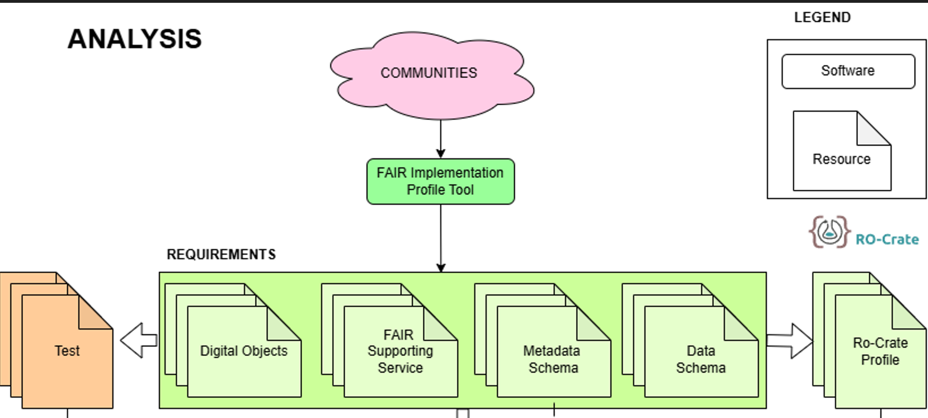
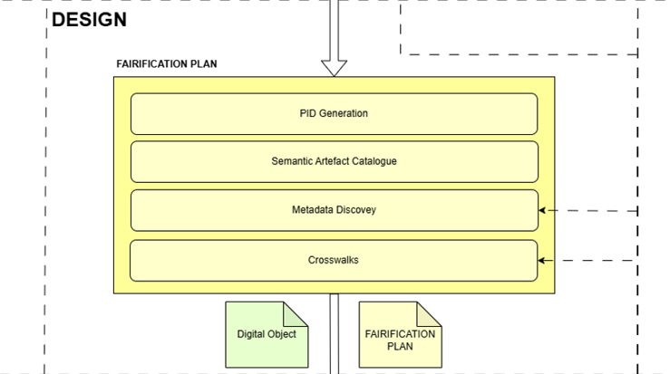
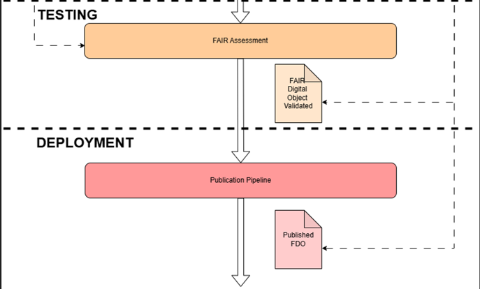

## Architecture

The Fairification Framework is composed by a stages pipeline to transform the resources of the Climate Adoption Community into Fair Digiatl Objects (FDOs). The approach followed is similat to the Software Development Lifecycle. 

The first stage is the analysis of the resources. The following picture depicted the resources and steps involved.

This stage involves a community-driven process to the development of FAIR (Findable, Accessible, Interoperable, Reusable) data practices. Communities will use the FAIR Implementation Profile Tool to extract the FAIR requirements. The outputs will include digital objects (publications, datasets and software), supporting FAIR services and (meta)data schema. These components collectively form a structured set of requirements that guide subsequent actions in the FAIR data ecosystem.

Based on these requirements, multiple Ro-Crate profiles are generated. These profiles will be used to describe the resources included in the FDO, according to the specific needs of the case studies.

As a secondary outcome, and also derived from the requirements, a collection of metrics will be defined to assess the FAIRness of the previously identified resources. This initial assessment will help identify which FAIR principles are not adequately addressed by the resources.

All this information will be submitted to the next stage, the design. The following figure depicts this stage.

This stage is responsible for defining a FAIRification plan—a document that outlines the steps needed to create an FDO. It includes the generation of PIDs, the creation of mappings to align specific metadata schemas with the Ro-Crate profiles created, and other relevant tasks.

This plan will be developed based on the FAIR assessment conducted in the previous stage, using the metrics defined during that same stage.

With this plan, with in the situation to execute the plan in the implementation stage, which is described in the following figure. 

The objective of this implementation is to create a FDO, following the plan designed in the previous stage. This first version of the FDO will be enrichment with more metadata extracted by multiple enrichment services. At the end a enriched FDO will be generated.

The final step is the testing and deployment stage. Next figure depicts the process implemented.

This stage will validate in the FDO created in the fairification process is valid based on the metrics defined by the community. The same FAIR Assessment tool used in the first stage will be used. Also, the ro-crates will be validated too.