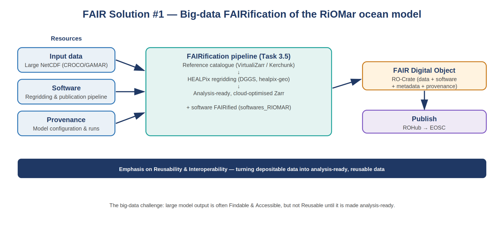
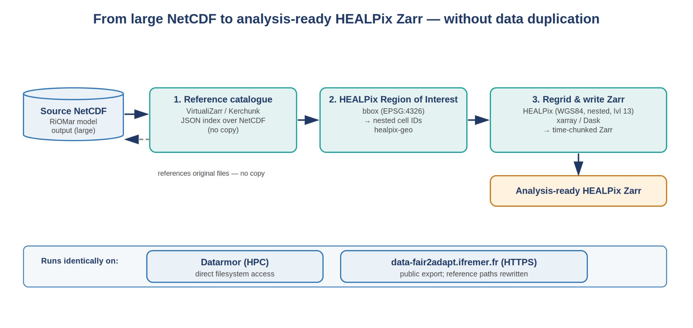
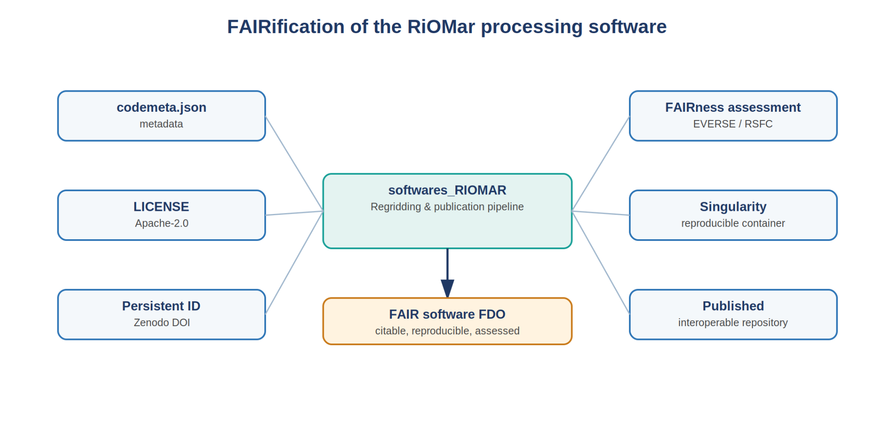
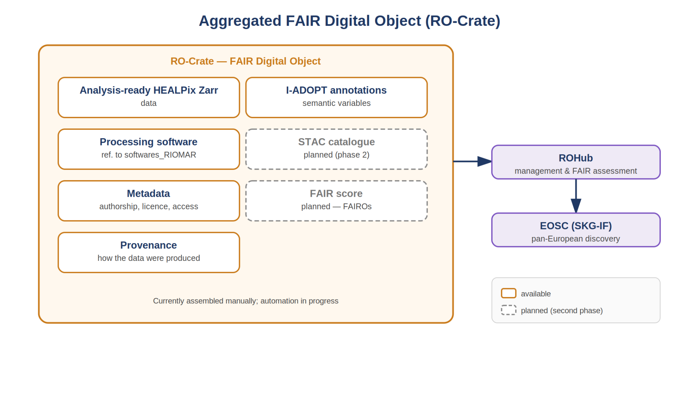
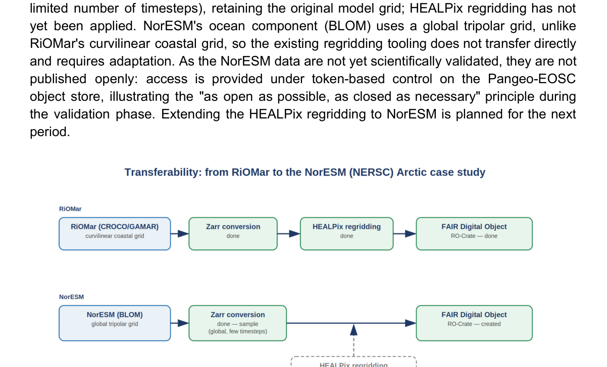

# FAIR Solution #1: Data processing pipeline for coastal water quality modelling

## Scenario

FAIR Solution #1 focuses on the FAIRification of very large, multi-dimensional ocean-model output from the **RiOMar case study (IFREMER)**. It validates how the FAIR Big Data Publishing Pipeline transforms high-volume model data into **analysis-ready, cloud-optimised FAIR Digital Objects**, with particular emphasis on Reusability and Interoperability.

The starting resources include large NetCDF outputs from the RiOMar CROCO/GAMAR coastal-ocean model, the software used for regridding and publication, and provenance describing model configurations and runs.

*RiOMar data sources and FAIRification pipeline.*

## Challenge addressed

Large model datasets can already be Findable and Accessible while remaining difficult to reuse. In RiOMar, practical reuse is limited when the data are not efficiently subsettable, are not cloud optimised, or are not aligned to a common grid.

The FAIR Solution therefore FAIRifies the data, software and outputs independently while preserving their relationships and provenance and aggregating them into a final FAIR Digital Object.

## FAIRification workflow

### Input big data

The original NetCDF data are exposed through **VirtualiZarr/Kerchunk reference catalogues**, avoiding unnecessary copying or fragmentation. A region of interest is selected and the data are regridded to **HEALPix/DGGS**, producing time-chunked, cloud-optimised Zarr stores.

*Conversion of large NetCDF model output into analysis-ready HEALPix Zarr through a reference catalogue.*

Metadata include authorship, licence, provenance and access conditions. Ocean variables are semantically annotated with **I-ADOPT** to improve machine-actionable interoperability.

### Processing software

The RiOMar processing software is FAIRified through:

* `codemeta.json` metadata;
* an Apache-2.0 licence;
* a persistent Zenodo identifier;
* automated software-quality and FAIRness assessment;
* Singularity containerisation for reproducible HPC execution;
* publication in an interoperable repository.

*FAIRification of the RiOMar processing software through metadata generation and FAIRness assessment.*

### Aggregated FDO

The analysis-ready output, source-data references, processing software, provenance and enriched metadata are aggregated in an **RO-Crate** managed through ROHub.

*Final FAIR Digital Object aggregating analysis-ready data, software, metadata and provenance.*

## Services involved

* FAIR Big Data Publishing Pipeline
* I-ADOPT Variable Service
* FAIR Assessment
* RO-Crate / ROHub publication
* software FAIRification and assessment mechanisms

## Validation and transferability

The solution validates the big-data publishing pipeline end-to-end for RiOMar. It also explores transfer to the **NorESM/NERSC Arctic case study**. A NorESM sample has been converted to Zarr, although HEALPix regridding still requires adaptation because the NorESM tripolar grid differs from RiOMar's coastal curvilinear grid.

*Extension of the big-data FAIRification pipeline from RiOMar to the NorESM Arctic case study.*

Planned developments include automated RO-Crate packaging, STAC cataloguing, automated FAIR Assessment through FAIROs/ROHub and further extension to NorESM.
