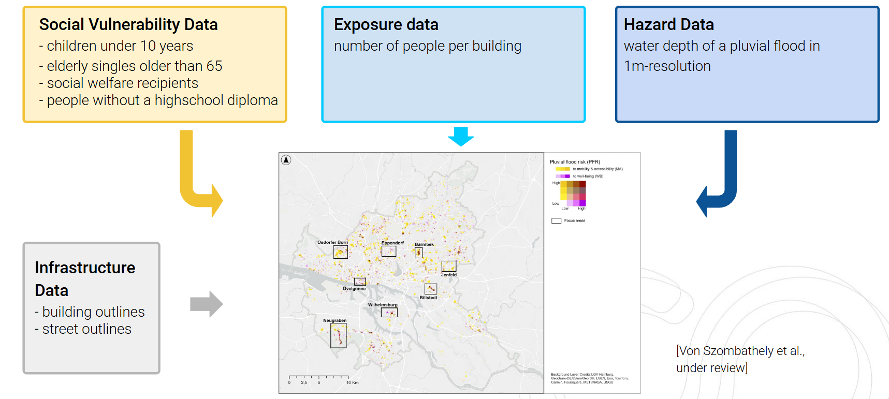
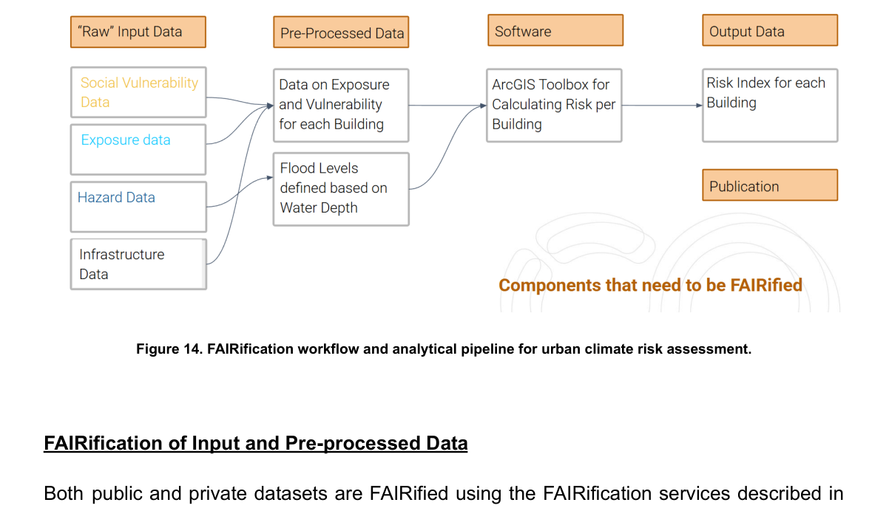
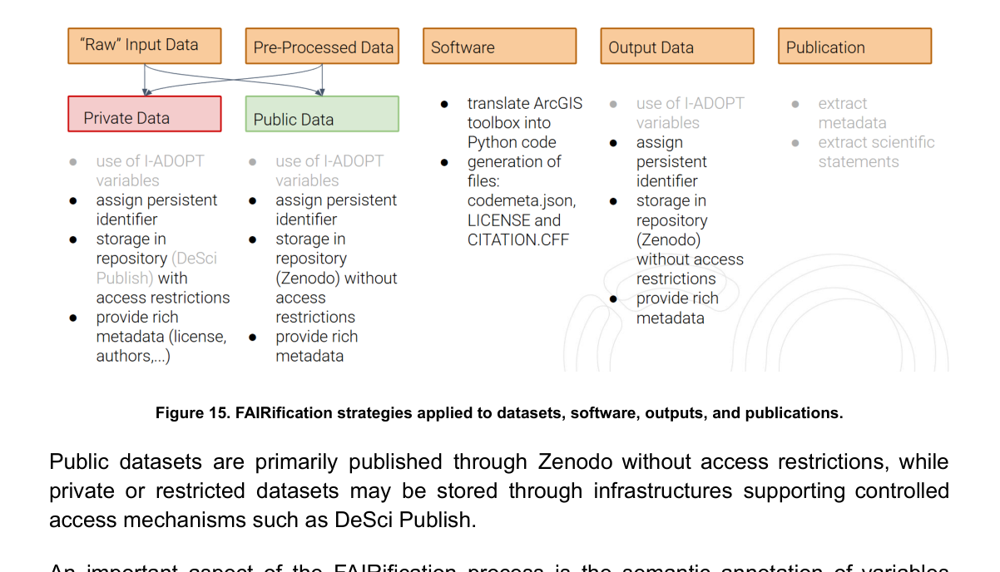
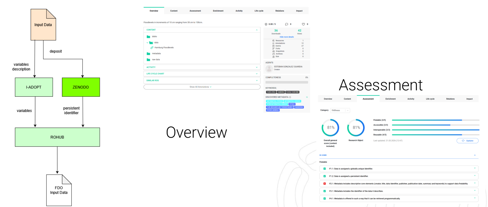
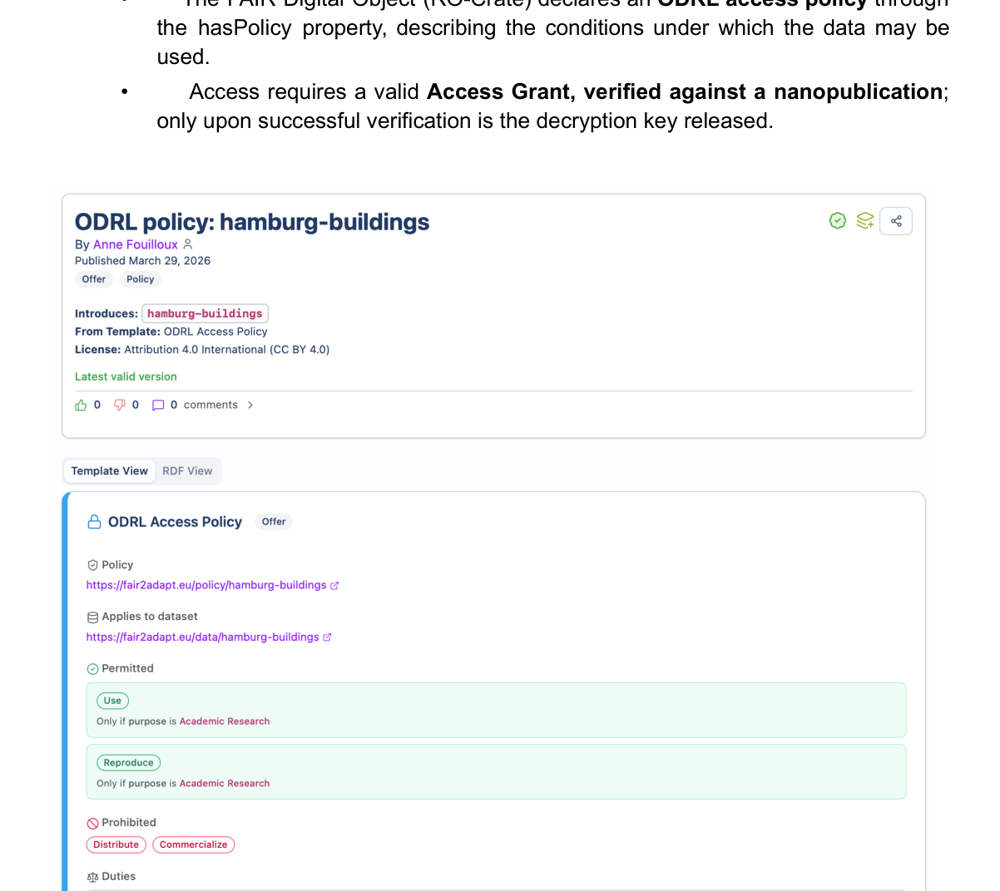
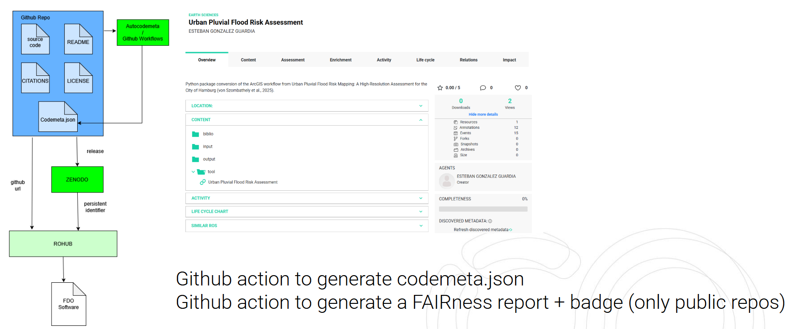
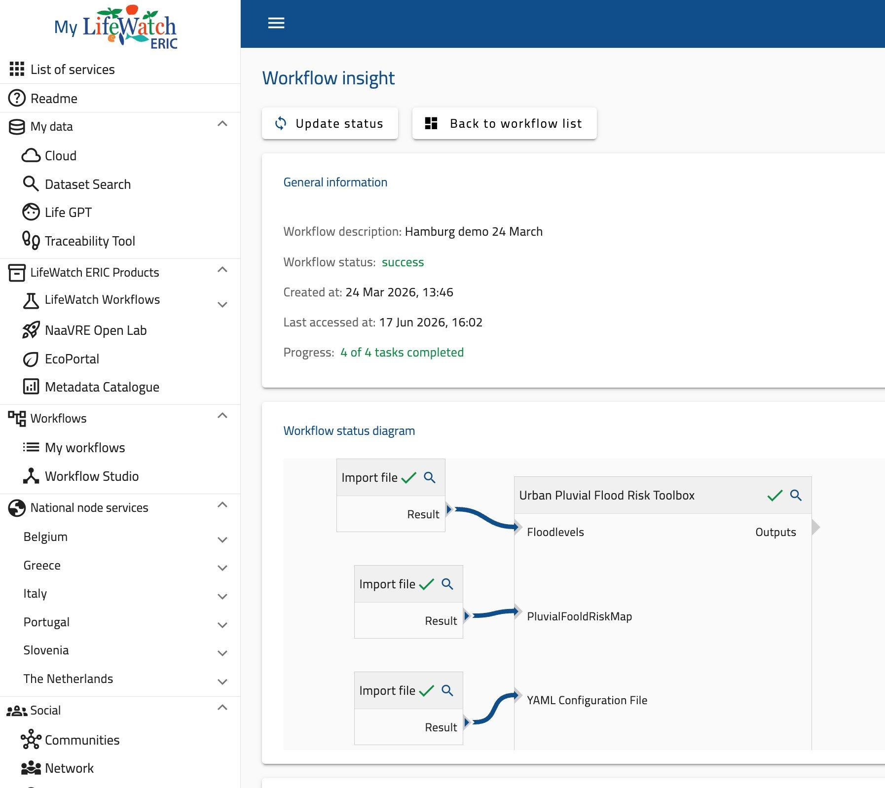
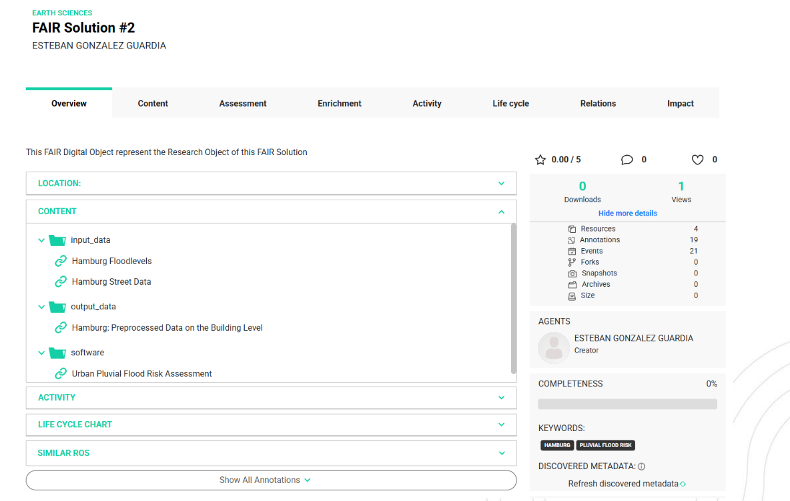
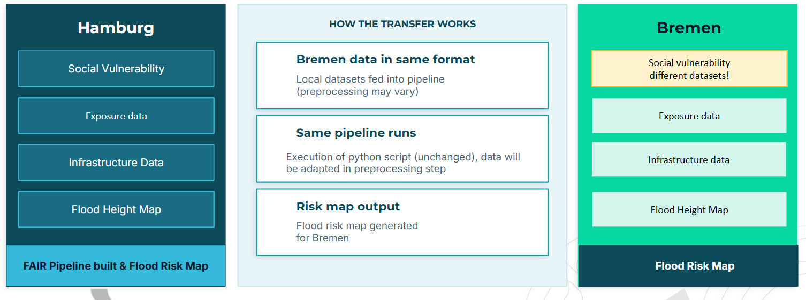

# FAIR Solution #2: FAIR GIS workflow for urban climate risk assessment

## Scenario

FAIR Solution #2 FAIRifies the complete **urban flood-risk assessment workflow** and its associated resources. The scenario demonstrates how datasets, software, analytical workflows and outputs can be transformed into interoperable FAIR Digital Objects.

The Hamburg workflow combines social-vulnerability indicators, population exposure data, pluvial-flood hazard maps and infrastructure information.

*Data sources involved in the urban climate-risk assessment.*

## FAIRification of heterogeneous resources

The solution distinguishes:

* raw input data;
* pre-processed data;
* software;
* output data;
* scientific publications.

Datasets are enriched with persistent identifiers, metadata, semantic annotations using **I-ADOPT**, access/reuse information and FAIR Assessment results.

*FAIRification workflow and analytical pipeline for urban climate-risk assessment.*

*FAIRification strategies applied to datasets, software, outputs and publications.*

*Example of FAIRification and FAIR Assessment of public climate-adaptation datasets in ROHub.*

## FAIR and controlled access

The solution explicitly demonstrates that FAIR does not imply that all data must be open. Sensitive Hamburg building-level data and derived outputs are handled using a policy-aware access pilot:

* AES-256-GCM encrypted data stored in object storage;
* an **ODRL** access policy declared by the RO-Crate;
* an Access Grant verified through a nanopublication;
* release of the decryption key only after successful verification.

Metadata remain openly Findable while the sensitive data are accessed under authentication and authorisation.

*Policy-controlled access for the Hamburg building dataset using an ODRL policy.*

## Software and workflow FAIRification

The original ArcGIS toolbox is translated into Python and enriched with:

* CodeMeta metadata;
* licence and `CITATION.cff`;
* SOMEF metadata extraction;
* FAIR Assessment;
* repository publication;
* automated GitHub Actions for metadata and FAIRness reports.

The workflow has been adapted for execution in the **LifeWatch ERIC Workflow System**, including an FDO mode in which it consumes and produces RO-Crates. I-ADOPT-based column mapping allows input columns to be interpreted through semantic variable definitions.

*FAIRification of software components through metadata generation and FAIRness-assessment automation.*

*Hamburg flood-risk workflow executed in the LifeWatch ERIC Workflow System.*

## FAIR outputs

The final RO-Crate can aggregate datasets, software, workflows, metadata, maps, semantic annotations and FAIR Assessment reports.

*Final FAIR Digital Object aggregating datasets, workflows, software, metadata and provenance.*

The workflow produces both private building-level outputs and privacy-preserving public outputs. Public layers are aggregated to HEALPix cells, supporting privacy while also aligning the output with the FAIR2Adapt DGGS ecosystem.

## Performance and scientific validation

Runtime optimisation is part of the Reusability objective. Spatial indexing, geometry tiling and efficient formats substantially reduce execution time on the Hamburg dataset. However, D3.2 explicitly notes that scientific validation of the optimised Python pipeline is still in progress because numerical differences with the original ArcGIS implementation remain under investigation.

## Transferability: Hamburg to Bremen

A central validation objective is reuse of the FAIRified workflow in **Bremen**. The methodology can remain the same while the vulnerability variables differ between cities. The transfer scenario therefore demonstrates why semantic interoperability and machine-actionable metadata are important for reusable climate-adaptation workflows.

*Reuse and transferability of the FAIRified urban flood-risk assessment workflow from Hamburg to Bremen.*
