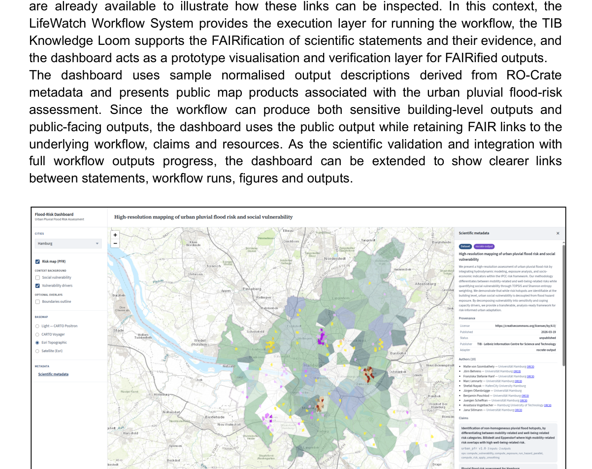

# FAIR Solution #3: Knowledge production from scientific publications

## Scenario

FAIR Solution #3 complements the executable workflow of FAIR Solution #2 by focusing on the **verification and FAIRification of scientific content** through the Knowledge Loom.

The objective is to move from findings that are embedded in publications or workflow outputs to structured, machine-readable scientific statements that are explicitly connected to their supporting evidence.

## Knowledge dashboard

The Knowledge Loom represents selected findings as machine-readable knowledge records. In the urban pluvial flood-risk scenario, evidence associated with a statement can include:

* input datasets;
* pre-processed spatial layers;
* the translated Python package;
* workflow outputs;
* generated figures;
* provenance;
* related RO-Crate metadata.

The LifeWatch Workflow System provides the execution layer, the **TIB Knowledge Loom** supports the FAIRification of statements and evidence, and a dashboard provides a prototype visualisation and verification layer.

*Knowledge dashboard linking public risk-map products, RO-Crate metadata and scientific claims.*

## FAIRification of scientific statements

The curation process generates and deposits the corresponding RO-Crate and ingests it into the Knowledge Loom. Individual scientific statements receive persistent identifiers, allowing them to become independently findable, citable and reusable.

Statements are linked to their evidence using typed, qualified relationships rather than simple file attachments. Provenance records how each statement was produced.

## FAIR result

The result is a fine-grained representation in which scientific statements and their supporting components are interlinked through:

* persistent identifiers;
* typed evidence links;
* provenance;
* RO-Crate metadata.

This enables scientific findings to be inspected and verified through the dashboard while remaining connected to the underlying workflow and evidence.
