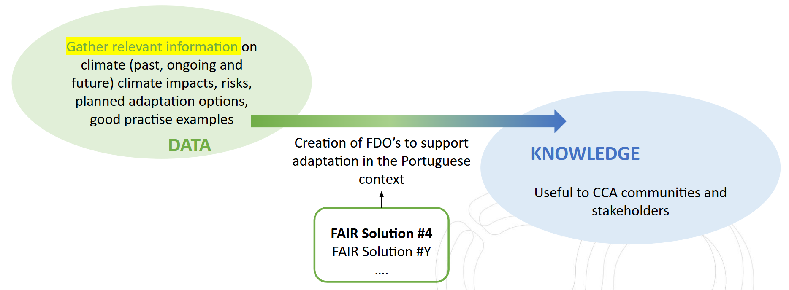
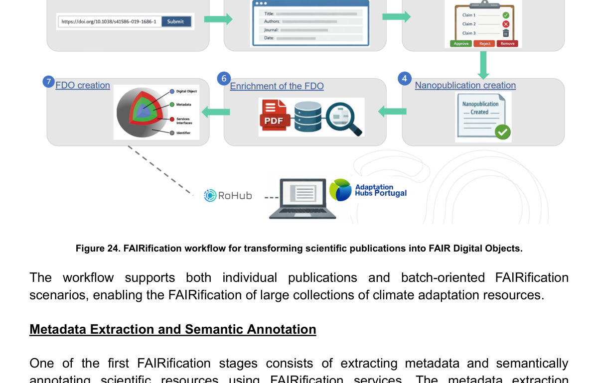
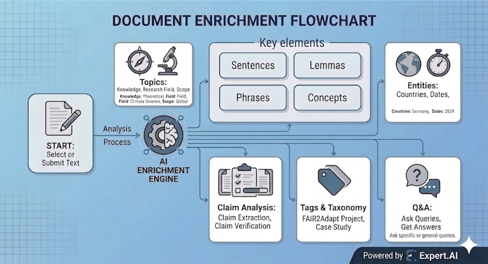

# FAIR Solution #4: Literature review and extraction pipeline

## Scenario

FAIR Solution #4 addresses scientific publications and climate-adaptation resources relevant to the **Portuguese adaptation context**. It demonstrates a FAIRification pipeline that transforms unstructured publications into semantically enriched, machine-actionable FAIR Digital Objects.

Its broader objective is to contribute to a **FAIR-by-design Portugal Adaptation Hub**.

## FAIRification workflow

The workflow contains six main stages:

1. publication selection;
2. metadata extraction;
3. scientific claim extraction and validation;
4. nanopublication creation;
5. semantic enrichment of the FAIR Digital Object;
6. FAIR Digital Object creation and publication.

The approach supports individual publications as well as batch-oriented processing of larger collections.

## Metadata and semantic enrichment

The enrichment stage extracts information such as authors, affiliations, keywords, publication metadata, licences, scientific variables and thematic categories.

**I-ADOPT** is used to semantically describe climate-adaptation variables. Extracted metadata, semantic enrichment and provenance are then combined to produce machine-actionable FAIR Digital Objects.

## Scientific claims

An important element of the FAIR Solution is the extraction and FAIRification of scientific claims. Scientific statements are identified from publications and validated through a combination of LLM-based processing and human curation.

The claims are aligned with the Climate Scenario 5 taxonomy and represented as machine-readable semantic assertions. Human validation remains an explicit quality-control step.

## Nanopublications and enriched FDOs

Validated claims are represented as **nanopublications** that capture the assertion together with provenance and supporting evidence.

These nanopublications are integrated into enriched FAIR Digital Objects together with metadata, provenance, datasets, software references, publications and semantic annotations.

## Portugal Adaptation Hub

The FAIR-by-design hub is intended to integrate datasets, publications, knowledge platforms and FAIR Digital Objects into a unified climate-adaptation ecosystem. The FAIRification services support:

* discovery and aggregation of climate-adaptation resources;
* machine-readable scientific knowledge;
* interoperability across adaptation platforms;
* reusable FAIR Digital Objects;
* programmatic access to claims and metadata.

The pilot validation demonstrates the feasibility of combining metadata extraction, semantic enrichment, claim extraction, nanopublication generation and FAIR Digital Object creation in one FAIRification pipeline.

## Figures from D3.2

\n\n*Figure 23. FAIR-by-design Portugal Adaptation Hub integrating climate-adaptation data, knowledge and FAIR Digital Objects.*\n\n\n\n*Figure 24. FAIRification workflow for transforming scientific publications into FAIR Digital Objects.*\n\n\n\n*Figure 25. Extended workflow supporting batch-oriented publication processing and semantic enrichment.*\n\n