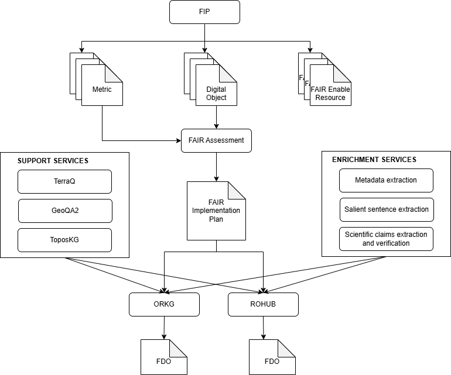

## Services

The FAIRification Framework is composed of various services used to create enriched FDOs. These services are integrated within the FAIRification Framework but can also be used independently of it.

In this section, the reader will find a brief description of each service involved, along with the endpoint for each service.

The following diagram (first version) depicts the interaction of the different services present in the framework

The process begins with the **FIP** service, which is used to identify the community requirements. It draws from three key types of resources:

- **Metrics**: FAIRness criteria that help evaluate the FAIRness of digital objects.
- **Digital Objects**: The digital objects identified by the communities and must be fairified.
- **FAIR Enabling Resources**: Tools or standards that support the implementation of FAIR principles.

Digital Objects are assessed using the provided **Metrics** and **FAIR Enabling Resources* by the FAIR Assessment service. This tool identifies both strengths and gaps in the object's FAIR compliance.

Based on the FAIR Assessment, a customized **FAIR Implementation Plan** is created.  This plan outlines necessary actions and steps to improve the FAIRness of the digital object. This plan includes the support and enrichment services needed.

The FAIR Implementation Plan is supported by two types of services:

#### Support Services
- **TerraQ**
- **GeoQA2**
- **ToposKG**  

These services simplify access to satellite imagery, enable natural language queries over geospatial knowledge graphs, and integrate comprehensive geospatial data including administrative boundaries and natural resources.

#### Enrichment Services
- **Metadata Extraction**
- **Salient Sentence Extraction**
- **Scientific Claims Extraction and Verification**  

These services enhance and enrich digital content, making it more structured and machine-actionable.

Improved and enriched digital objects are then integrated into:

- **ORKG (Open Research Knowledge Graph)**
- **ROHUB**

These platforms act as repositories or environments for hosting FDOs.Both ORKG and ROHUB generate **FDOs (FAIR Digital Objects)** based on the profiles developed in the project.  

These FDOs are enriched, interoperable, and aligned with FAIR principles for reuse and sharing.